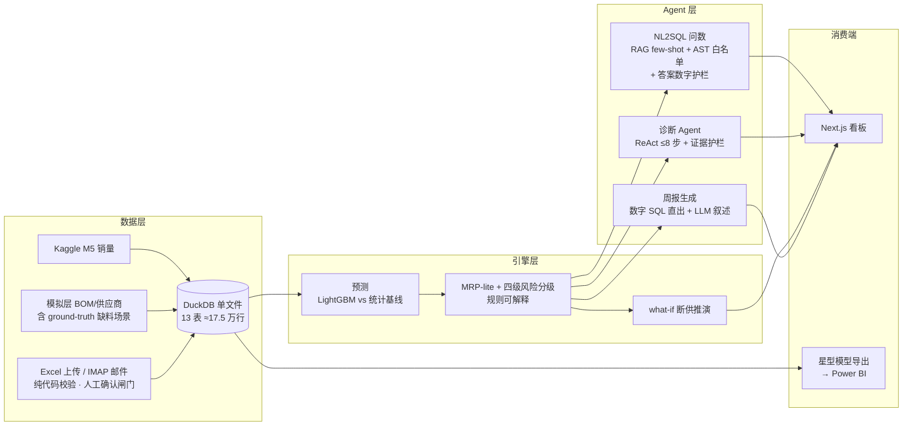
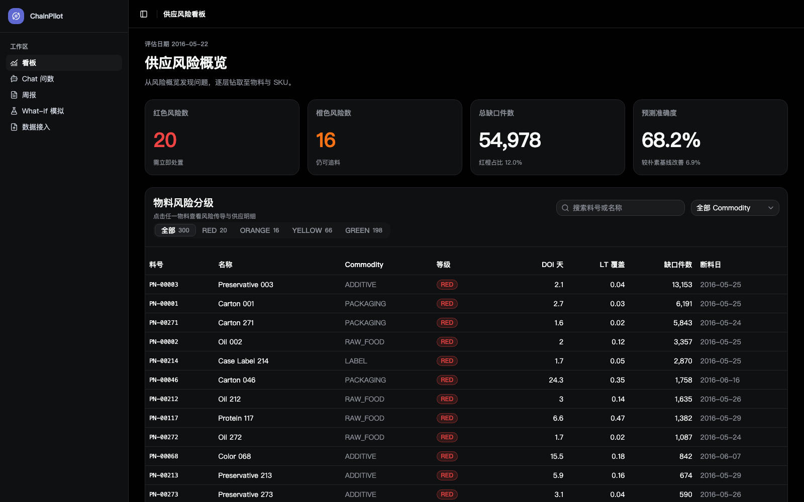
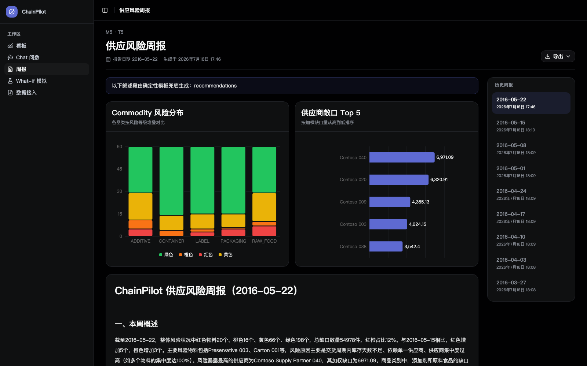
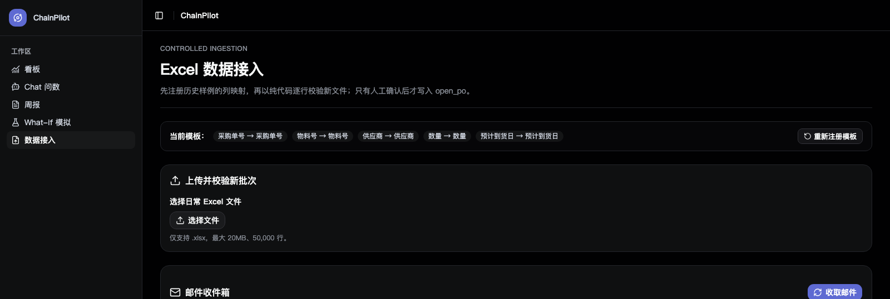

# ChainPilot

供应链智能分析 Agent —— 需求预测 · 缺料风险分级 · 证据护栏问数 · 根因诊断 · 断供推演 · 可控数据接入

**Supply-chain analytics agent** — demand forecasting, shortage risk grading, evidence-guarded NL2SQL, root-cause diagnosis, outage simulation, and human-gated data ingestion. *(English summary below.)*


## 它解决什么问题

供应链计划员每天面对的三件事：**看现状**（哪些物料要缺料）、**问数据**（临时组合问题没有现成报表）、**追原因**（为什么这颗料红了）。ChainPilot 用一套可评测、可解释、带硬护栏的 AI 系统覆盖这条链路——每个数字都能回查出处，答不了的问题明确拒答。

## 架构



## 关键指标（全部可复现，出处见 docs/评测\_\*.md）

| 模块 | 指标 | 数字 |
|---|---|---|
| 需求预测 | LightGBM vs 季节基线 MAPE 相对改善 | **15.76%**（WRMSSE 0.885 < 0.929） |
| 风险分级 | ground-truth 缺料场景召回 | **10/10**（误报逐条核查均有缺口证据） |
| NL2SQL 问数 | 50 题执行正确率 / 对抗题拒答 | **90%** / **10/10** |
| RAG few-shot | A/B vs 固定 few-shot | 正确率打平 ~93%，**prompt token 省 24%** |
| 诊断 Agent | 10 场景归因（×3 遍复测） | **10/10**，均步 4.0，≈¥0.004/场景 |
| 工程 | 自动化测试 / 部署 | 170+ pytest + CI，Docker Compose 一键起 |

## Quickstart（Docker，3 步）

前提：Docker；Kaggle 账号（下载 M5 数据用）；DeepSeek API key 可选。

```bash
# 1. 建库（宿主机执行一次；Kaggle 凭据配置见脚本头部说明）
python data/scripts/run_all.py

# 2. 一键起前后端（可选：cp .env.example .env 并填入 DEEPSEEK_API_KEY）
docker compose up -d

# 3. 打开
open http://localhost:3000
```

可选增强（按需）：

```bash
cd api
.venv/bin/python -m analytics.backfill --periods 8   # 回填 8 个历史评估期（周报环比）
.venv/bin/python -m agent.retrieval --build          # 构建 RAG few-shot 向量索引
```

本地开发路径（不用 Docker）：

```bash
cd api && python -m venv .venv && .venv/bin/pip install -r requirements.txt \
  && .venv/bin/uvicorn app.main:app --reload          # 后端 :8000
cd web && npm install && npm run dev                  # 前端 :3000
```

## 功能一览

- **看板**：KPI（红/橙/缺口/预测 FA）→ 四级风险表 → 单料钻取（人话解释/贡献 SKU/供应商拆分/在途 PO）→ 预测曲线三模型对比
- **Chat 问数**：自然语言 → SQL（阶段级 SSE 直播）；答案数字与结果表格双向高亮溯源；超范围问题明确拒答
- **周报**：数字 SQL 直出 + LLM 叙述段（校验不过自动降级为纯模板）；历史环比；PDF/Excel 导出
- **What-if**：供应商 X 断供 N 天 → 新增红橙/受影响 SKU/金额敞口（上限 28 天 = 预测地平线，超出会静默低估故硬限）
- **诊断 Agent**：点击物料 → ReAct 逐步直播（查什么、看到什么、下一步）→ 带证据引用的归因结论
- **数据接入三部曲**：Excel 模板注册上传（LLM 仅建议列映射）→ IMAP 邮件半自动收件（白名单+人工确认闸门）→ 确定性清洗规则（逐格 diff，只修格式不猜内容）；批次追踪一键撤销
- **Power BI 双轨**：`python data/scripts/export_bi.py` 导出 5 表星型模型 → Power BI Desktop 看板

## 界面预览

**供应风险看板** — KPI 概览 → 四级风险表 → 单料钻取：



**供应风险周报** — 数字 SQL 直出 + LLM 叙述，图表化环比，历史周报可回溯：



**Excel 数据接入** — 模板注册 + 纯代码校验 + 邮件收件箱，人工确认后才写库：



## 设计原则（详见 docs/00_项目蓝图.md）

1. **护栏是代码不是 prompt**：SQL 过 AST 白名单只读执行；答案数字与结果集程序比对，不过即拒答
2. **LLM 不碰数据行**：数据校验/导入/清洗全部确定性代码，LLM 锁死在配置路径（列映射建议）
3. **写库的最后一道闸是人**：二段式确认 + 批次可撤销 + 确认时重新校验
4. **一切可复现**：seed=42，两跑哈希一致是常规验收项；评测迭代过程（含失败版本）全留档 `evals/results/`

## Known limitations

- 历史回填中供给侧沿用 `eta_date > cutoff` 近似（open_po 无下单日期列），历史缺口系统性偏小
- 周报为"生成即落库"，上游数据重算后需重新生成
- 邮件接入的发件人白名单防误发不防伪造（生产需 DKIM/SPF）；CI 无真库故 6 项测试仅本地覆盖
- what-if 金额敞口为瓶颈口径上限估算

## 文档

| 文档 | 内容 |
|---|---|
| [00_项目蓝图](docs/00_项目蓝图.md) | 定位、D1~D9 选型决策、明确不做清单 |
| [01_数据字典](docs/01_数据字典.md) | 表结构、风险规则、业务术语表（问数 Agent 运行时读取） |
| [02_模块执行清单](docs/02_模块执行清单.md) | M0~M6 全任务与验收记录 |
| [评测_总报告](docs/评测_总报告.md) | 预测/风险/问数全指标汇总（含漂移检测） |
| [docs/prompts/](docs/prompts/) | 全部任务卡与逐单 Review 记录（工程过程完整留痕） |

---

## English Summary

ChainPilot is a supply-chain analytics agent built end-to-end in 4 weeks: demand forecasting (LightGBM vs. statistical baselines, **15.76% relative MAPE improvement**), MRP-lite shortage risk grading (**10/10 recall** on injected ground-truth scenarios), evidence-guarded NL2SQL (**90%** execution accuracy, **10/10** adversarial refusals, RAG few-shot saving **24% prompt tokens** at parity accuracy), a ReAct root-cause diagnosis agent (**10/10** attribution, ~4 steps, ≈¥0.004/case), what-if supplier-outage simulation, and a human-gated ingestion pipeline (Excel upload + IMAP intake + deterministic repair rules — the LLM never touches data rows). FastAPI + Next.js with mirrored Pydantic/Zod contracts, DuckDB single-file storage, 170+ tests with CI, one-command Docker Compose deployment, and a star-schema export feeding both the built-in dashboard and Power BI. All randomness is seeded; every metric is reproducible; every eval iteration (including failures) is kept in `evals/results/`.

**Quickstart**: `python data/scripts/run_all.py` → `docker compose up -d` → open `http://localhost:3000`.

## 声明 / Disclaimer

本项目使用公开数据集（Kaggle M5）与脚本生成的模拟数据，业务术语均为制造业通用概念，不包含任何企业内部数据。
Built exclusively on public datasets (Kaggle M5) and script-generated simulation data; all terminology is industry-generic. No proprietary data involved.
